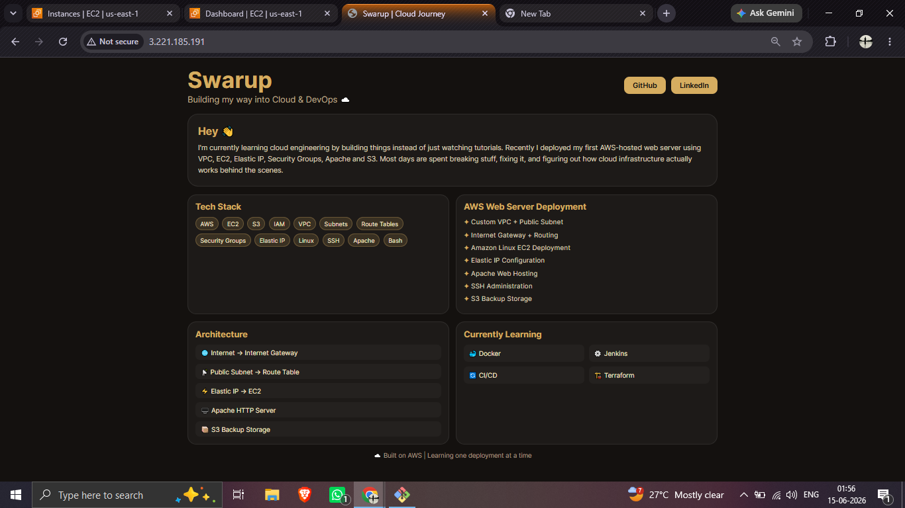
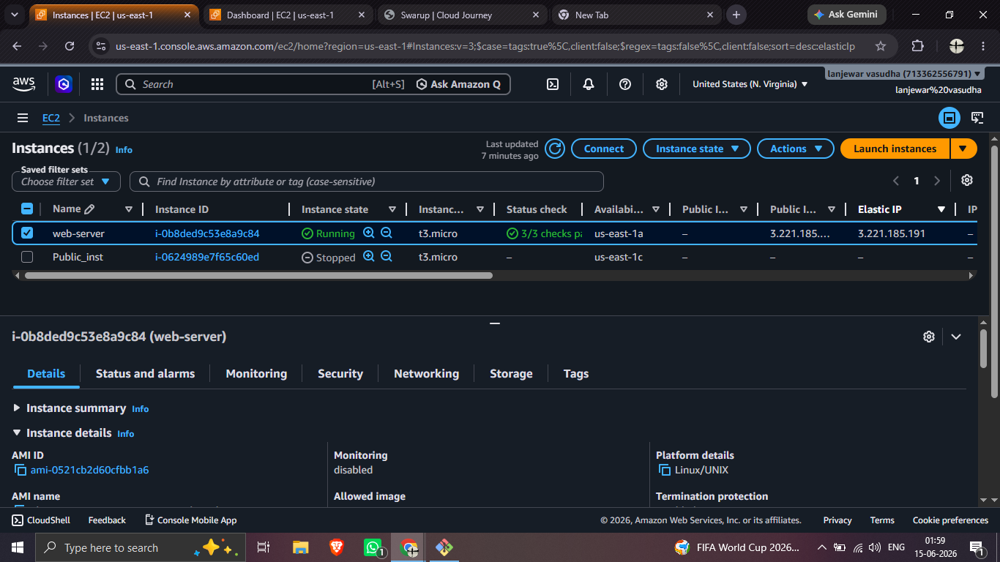
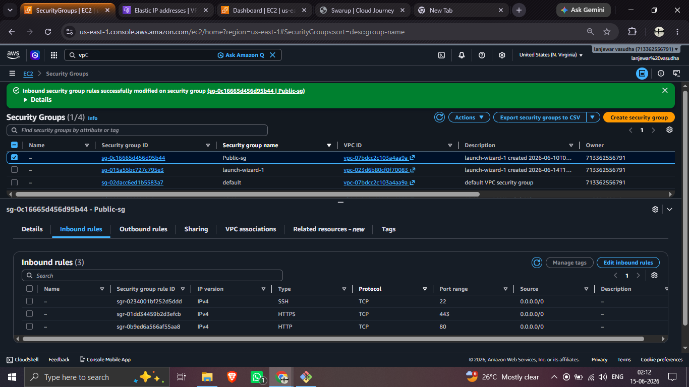
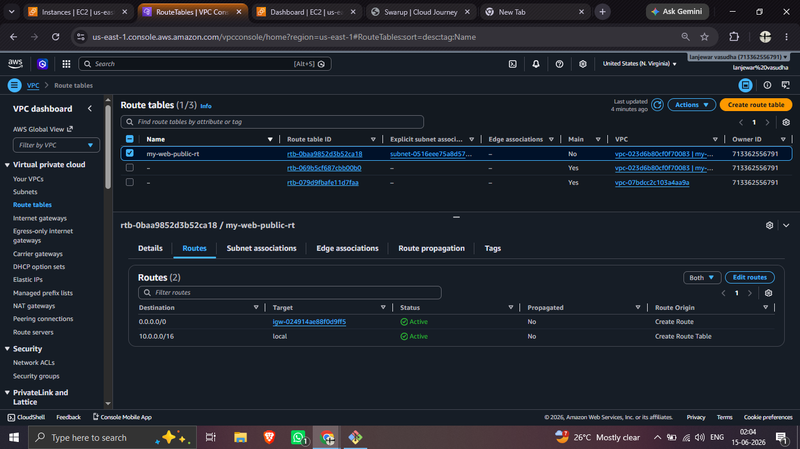
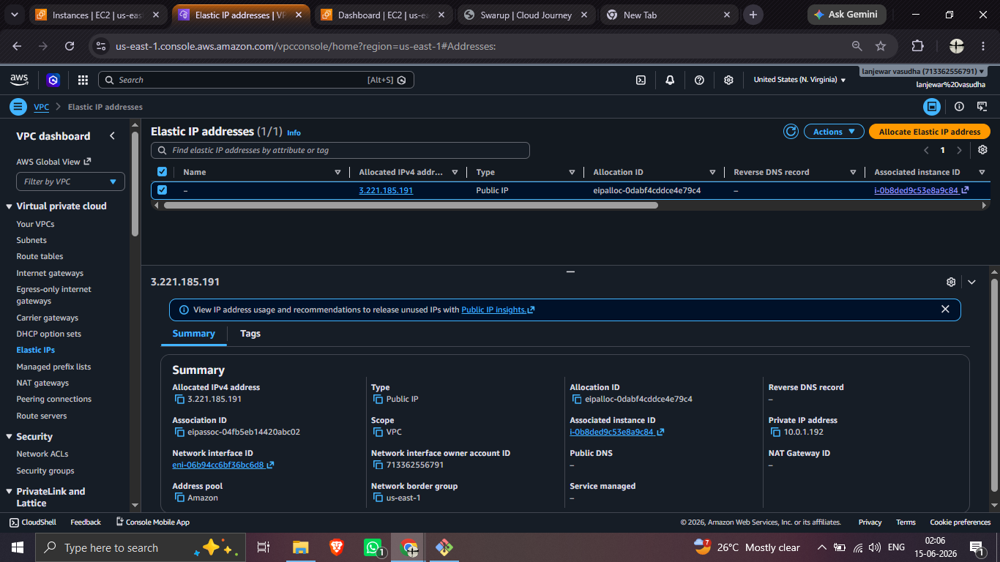

# AWS Web Server Deployment ☁️

## Overview

Built and deployed a Linux web server on AWS to gain hands-on experience with cloud infrastructure, networking and server administration.

## Services Used

* Amazon EC2
* Amazon VPC
* Public Subnet
* Route Tables
* Internet Gateway
* Security Groups
* Elastic IP
* Amazon S3
* Apache HTTP Server

## Architecture

Custom VPC → Public Subnet → Internet Gateway → Elastic IP → EC2 (Apache) → S3 Backup

## What I Built

* Created a custom VPC and public subnet
* Configured internet access using Route Tables and Internet Gateway
* Launched an Amazon Linux EC2 instance
* Associated an Elastic IP for stable public access
* Hosted a portfolio website using Apache HTTP Server
* Connected securely using SSH
* Stored backups in Amazon S3

## Screenshots

### Website

### EC2 Instance

### Security Group

### Route Table

### Elastic IP

## Skills Demonstrated

AWS • Linux • Networking • SSH • Apache • Cloud Security

## Next Steps

Docker • Jenkins • CI/CD • Terraform

---

**Swarup**
Building my way into Cloud & DevOps ☁️
